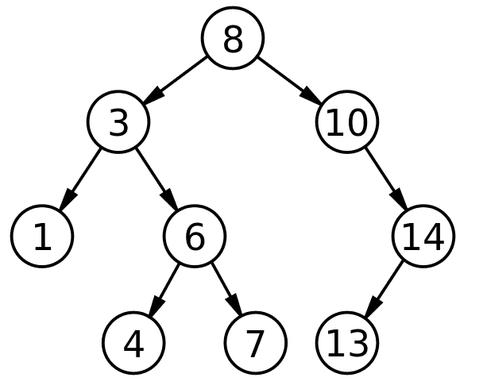

# Binary Search Tree

El Binary Search Tree (BST) o Árbol de Búsqueda Binaria es una estructura de datos que combina la flexibilidad de las *LinkedLists* con la eficiencia de la *Binary Search*. Mientras que los arreglos pueden tener datos arbitrarios, los árboles que analizamos aquí están diseñados para mantener los datos ordenados y permitir accesos rápidos.

A continuación, presento la explicación teórica basada en las nuevas fuentes proporcionadas:

## Estructura y Definición

En su núcleo, un árbol es muy similar a una *LinkedList*: se compone de nodos que tienen valores y punteros hacia otros nodos. La diferencia clave es que, mientras una lista enlazada solo apunta al "siguiente", un árbol puede tener múltiples punteros.

- Binary (Binario): Cada nodo puede tener como máximo dos hijos (izquierda y derecha). Puede tener dos, uno o ninguno.
- Search (Búsqueda): Está optimizado para escenarios de búsqueda rápida.
- Reglas de Orden: Para que un árbol sea un BST válido, debe seguir reglas estrictas el 100% del tiempo:
  - Todo nodo en el subárbol izquierdo debe ser menor que el nodo padre.
  - Todo nodo en el subárbol derecho debe ser mayor que el nodo padre.
  - Los valores duplicados deben manejarse de forma consistente (por ejemplo, colocándolos siempre a la izquierda).

## Operaciones Fundamentales

### Búsqueda (Look Ups)

- El algoritmo de búsqueda es sencillo gracias a las reglas de orden. Comienza en la raíz y compara:
  - Si el valor buscado es menor, va a la izquierda.
  - Si es mayor, va a la derecha.
  - Si es igual, has encontrado el elemento.
- En un árbol bien equilibrado, no necesitas revisar todos los elementos, solo una pequeña muestra, lo que resulta en una eficiencia promedio de $O(\log n)$.

### Inserción (Add)

Para agregar un elemento, se reutiliza la lógica de búsqueda. Se recorre el árbol decidiendo "izquierda o derecha" hasta encontrar un espacio vacío (null). Ahí se crea el nuevo nodo y se conecta. Al igual que la búsqueda, esto suele tomar $O(\log n)$.

### Eliminación (Delete)

- Es la operación más compleja porque no se puede simplemente borrar un nodo sin romper las conexiones del árbol. Existen tres escenarios:

1. Hoja (sin hijos): Simplemente se elimina el nodo.
2. Un solo hijo: El padre del nodo eliminado apunta directamente al único hijo del nodo borrado, saltándose al intermediario.
3. Dos hijos: No se puede borrar directamente. Se debe encontrar un reemplazo que mantenga la lógica del orden. La estrategia común es reemplazar el valor del nodo a borrar con el menor valor del subárbol derecho (o el mayor del izquierdo) y luego eliminar ese nodo duplicado en el fondo del árbol.

## Análisis de Complejidad y Riesgos

- Caso Promedio - $O(\log n)$: Tanto para búsquedas, inserciones y eliminaciones. Esto es muy rápido incluso en conjuntos de datos enormes.
- Mejor Caso - $O(1)$: Ocurre si buscas exactamente el nodo raíz.
- Peor Caso - $O(n)$: Este es el "talón de Aquiles" del BST. Si insertas una lista de números ya ordenados (ej. 1, 2, 3, 4, 5), cada nuevo número se irá a la derecha del anterior. Esto crea una línea recta que funcionalmente es idéntica a una *LinkedList*, perdiendo toda ventaja de velocidad y obligando a recorrer cada ítem.

*Nota: Para evitar este peor caso, las fuentes mencionan que existen variaciones que se auto-balancean, como los árboles AVL, que se verán más adelante.*

## Caso de Uso Real: Índices de Bases de Datos

- ¿Por qué pasar por el trabajo de construir un árbol? Las fuentes destacan su uso en índices de bases de datos.
  - No es práctico reordenar toda una base de datos física cada vez que entra un dato.
  - En su lugar, se mantiene la base de datos tal cual y se crea un árbol separado que actúa como índice.
  - Cuando buscas un número de pedido, el sistema hace una búsqueda rápida en el árbol ($O(\log n)$), el cual contiene un puntero a la ubicación exacta del dato completo en la base de datos, evitando tener que "peinar" toda la información.

## Analogía para entender el BST

Imagina que estás organizando una foto familiar piramidal. Tú estás arriba. A tu mano izquierda pones a alguien más bajo que tú, y a tu derecha a alguien más alto. Esa persona más baja a su vez hace lo mismo: pone a alguien más bajo que ella a su izquierda y a alguien más alto (pero aún más bajo que tú) a su derecha. Si buscas a alguien de estatura media, no tienes que preguntar a todos; simplemente miras a la persona del tope y sabes inmediatamente si debes bajar por el lado izquierdo o derecho, descartando a la mitad de la familia en cada paso.

## Infografía

