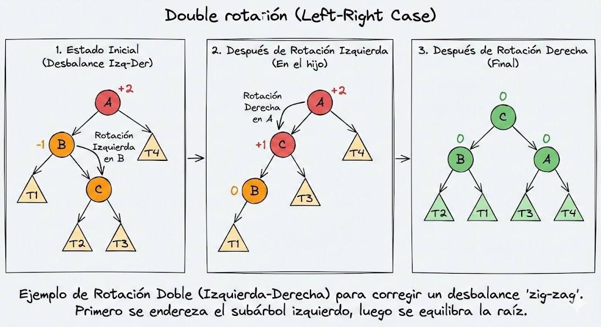

# AVL Tree

El Árbol AVL (llamado así por las iniciales de sus creadores: Georgy Adelson-Velsky y Evgenii Landis) surge como la solución directa a la mayor debilidad de los Árboles de Búsqueda Binaria (BST) que discutimos anteriormente: el desequilibrio.

## El Problema del BST y la Solución AVL

Como vimos en la sección de BST, si insertas datos ordenados (o incluso con una distribución aleatoria desafortunada), un árbol binario puede volverse "pesado" de un lado, pareciéndose más a una línea recta que a un árbol. Esto degrada su rendimiento a $O(n)$.

- Definición: Un AVL es un BST especializado. Todo árbol AVL válido es también un BST válido, pero no al revés.
- El Objetivo: El propósito del AVL es garantizar matemáticamente que el árbol se mantenga equilibrado, asegurando que nunca se caiga en el peor caso de rendimiento. Con un AVL, el peor escenario garantizado es $O(\log n)$, protegiendo la eficiencia de las búsquedas.

## Mecanismo de Funcionamiento

El proceso de añadir un valor a un AVL es idéntico al de un BST normal, con una diferencia crítica que ocurre después de la inserción:

- Verificación Recursiva: Una vez que se inserta el nodo, el algoritmo verifica el equilibrio de los nodos en el camino de regreso hacia la raíz (durante el retorno de la recursión).
- Regla de Equilibrio: Un árbol se considera desequilibrado si la diferencia de altura entre sus dos subárboles (izquierdo y derecho) es mayor a 1. Si la diferencia es 0 o 1, el árbol es válido; si es 2 o más, se debe corregir.

## Las Rotaciones (Re-balanceo)

La parte más compleja y fundamental de los AVL son las rotaciones. Si el algoritmo detecta que un nodo está desequilibrado, realiza una operación para reorganizar los nodos y restaurar el equilibrio sin romper las reglas de orden del BST.

Existen dos tipos principales de correcciones:

### Rotación Simple (Single Rotation)

- Se utiliza cuando el desequilibrio es lineal.
  - Ejemplo: Imagina un nodo que está "pesado a la derecha" (tiene mucha altura a su derecha), y su hijo derecho también está "pesado a la derecha".
  - Acción: Se realiza una rotación (izquierda o derecha dependiendo del caso) intercambiando la posición del padre y el hijo para aplanar la estructura.

### Rotación Doble (Double Rotation)

- Se utiliza en casos más complejos donde el desequilibrio es "cruzado" o en zig-zag.
  - El Problema: Si intentas hacer una rotación simple cuando el nodo es "pesado a la derecha" pero su hijo es "pesado a la izquierda" (el peso está en el hijo opuesto), la rotación simple no solucionará el problema.
  - Acción: Se requieren dos pasos:
      1. Primero, se realiza una rotación sobre el nodo hijo para alinear el peso.
      2. Luego, se realiza la rotación sobre el nodo principal para equilibrar el árbol.
- Básicamente, conviertes el zig-zag en una línea recta y luego aplicas la rotación simple.
- 

## Conclusión y Trade-off

El "costo" de usar un AVL es el esfuerzo extra que la computadora debe realizar cada vez que se agrega o elimina un dato para verificar alturas y realizar rotaciones. Sin embargo, este esfuerzo se justifica plenamente en aplicaciones donde se requiere asegurar tiempos de lectura rápidos y constantes, eliminando el riesgo de que la estructura de datos se degrade.

## Analogía para entender el AVL

Imagina un móvil colgante de cuna para bebés. Un BST normal permite colgar objetos donde quieras, lo que puede hacer que todo el móvil se incline peligrosamente hacia un lado si pones mucho peso en una sola rama. Un AVL es un móvil inteligente que, cada vez que cuelgas un nuevo juguete, verifica automáticamente si está inclinado. Si detecta que un lado está mucho más bajo que el otro (diferencia de altura > 1), automáticamente gira los hilos y cambia la posición de los juguetes (rotación) para que el móvil vuelva a estar perfectamente horizontal.

## Infografía

