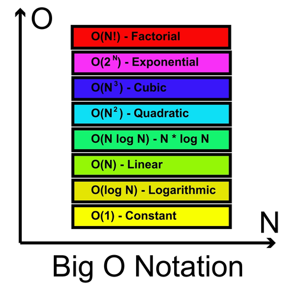

# Big O

## Concepto de Big O

- Es la forma en que se analiza la eficiencia de los algoritmos o del código sin entrar en detalles excesivamente minuciosos.
- Es un método para medir cómo escala el tiempo de ejecución a medida que aumentan los datos, priorizando la simplicidad del análisis sobre la precisión matemática absoluta.

## Características clave de Big O

- Enfoque en diferencias significativas: A la notación Big O no le interesa si una función tarda 300 milisegundos frente a 330 milisegundos; lo que busca identificar es si la diferencia es masiva, como 300 milisegundos frente a 30 segundos.

- La "O" como una aspiradora que succiona toda la información irrelevante y deja solo lo importante. Esto implica ignorar las partes pequeñas de una ecuación (como los términos menores y los coeficientes) y concentrarse únicamente en el término más grande, que es el que realmente impacta el rendimiento a gran escala.
  - En la notación Big O, el concepto de "términos" se utiliza para simplificar el análisis de la eficiencia de un algoritmo, centrándose únicamente en lo que realmente impacta el rendimiento a gran escala.
  - Término: Desde una perspectiva matemática, un término es cada una de las piezas de una ecuación, que normalmente están separadas por signos de suma (+) o resta (-). Por ejemplo, en la ecuación $3x^2 + x + 1$, el primer término es $3x^2$, el segundo es $x$ y el tercero es $1$.
  - La dominancia del término mayor: La mayor parte del "pastel" (el tiempo de ejecución) proviene del primer término (el de mayor exponente). Cuando se utilizan números muy grandes, la diferencia entre el término más grande y los demás se vuelve masiva. Por ejemplo, si $x$ es 5,000,000, el primer término de la ecuación anterior sería 75 billones, mientras que el segundo sería solo 5 millones, una brecha enorme que hace que los términos menores sean insignificantes.
  - Simplificación final: Para obtener el Big O, simplemente se toma el término más grande y se elimina cualquier factor o coeficiente que lo acompañe. Siguiendo el ejemplo de $3x^2 + x + 1$, el Big O sería simplemente $O(n^2)$, ya que la notación absorbe el resto del "relleno".

- Análisis del peor de los casos: A menos que se indique lo contrario, el Big O se calcula asumiendo el peor escenario posible para la ejecución del código. Por ejemplo, en una función de búsqueda, el peor caso sería que el elemento buscado sea el último de la lista.

- Herramienta de nivel superior: Se define como una herramienta útil para obtener una visión de alto nivel y decidir si una implementación cumple con el perfil de rendimiento necesario según el contexto. El análisis Big O carece de utilidad sin contexto; por ejemplo, un algoritmo menos eficiente (como $O(n^2)$) podría ser preferible si es más fácil de entender y el volumen de datos es pequeño.

## Analogía

- Analogía: Imagina que Big O es como planear el presupuesto de un viaje. No te detienes a contar cuántos centavos gastarás en cada caramelo (los términos menores), sino que te concentras en los gastos grandes como el avión y el hotel (el término dominante), porque son esos los que realmente determinarán si puedes costear el viaje o no.

## La Jerarquía de Complejidades (El "Ranking")

- En Big O, casi siempre trabajamos con un conjunto fijo de funciones. Es útil saber cuál es "mejor" y cuál es "peor".

- Ordenadas de mejor (más eficiente) a peor (menos eficiente):
  - $O(1)$ - Constante (Instantáneo, el santo grial).
  - $O(\log n)$ - Logarítmica (Muy rápido, común en búsqueda binaria).
  - $O(n)$ - Lineal (Proporcional, recorrer una lista una vez).
  - $O(n \log n)$ - Lineal-logarítmica (El estándar para ordenar datos eficientemente, como Merge Sort).
  - $O(n^2)$ - Cuadrática (Bucles anidados, lento con muchos datos).
  - $O(2^n)$ - Exponencial (Muy lento, común en recursividad bruta).
  - $O(n!)$ - Factorial (Imposible de ejecutar para $n$ grandes).
