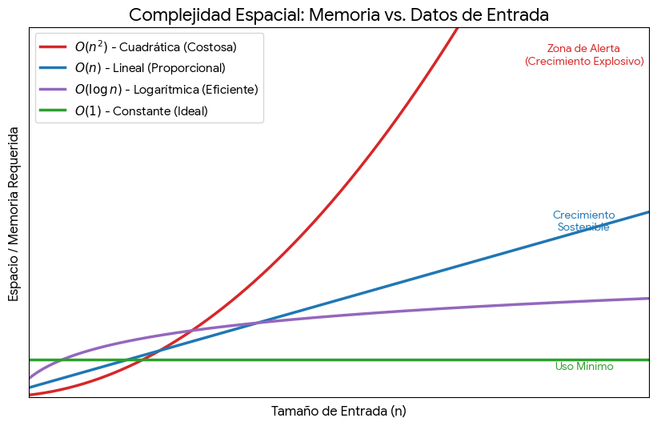

# Spatial Complexity

- La complejidad espacial se refiere a la cantidad de espacio (como memoria RAM o espacio en disco) que un algoritmo necesita para completar su ejecución. Mientras que comúnmente el término "Big O" se asocia con el tiempo que tarda un proceso (complejidad computacional), también es fundamental para analizar el consumo de recursos físicos.

## Tipos de Complejidad Espacial

- Constante $O(1)$: Ocurre cuando un algoritmo utiliza la misma cantidad de espacio sin importar el tamaño de los datos de entrada. Por ejemplo, si un proceso no crea arreglos adicionales o solo crea una cantidad fija (como 10 arreglos) sin importar si la entrada es de 10 o 1,000 elementos, su necesidad espacial es constante.
- Logarítmica $O(\log n)$: Se presenta cuando el espacio extra requerido aumenta de forma cada vez más lenta a medida que crece la entrada. Un ejemplo sería un algoritmo que para 10 elementos crea 7 arreglos, para 100 crea 12 y para 1,000 crea solo 20.
- Lineal $O(n)$: Se da cuando el algoritmo necesita crear recursos adicionales de manera proporcional a la entrada. Por ejemplo, si para cada elemento de un arreglo se necesita crear otro arreglo durante un proceso de ordenamiento, la complejidad es $O(n)$.
- Cuadrática $O(n^2)$: Es un nivel de complejidad poco común y usualmente una señal de alerta ("red flag"). Un ejemplo es un sistema que calcula y almacena la distancia entre cada código postal de un país hacia todos los demás; cada vez que se añade un código nuevo, se deben agregar miles de nuevas entradas para cubrir todas las combinaciones posibles.
- 

## El Intercambio (*Trade-off*) entre Tiempo y Espacio

- No existe un algoritmo que sea necesariamente "mejor" que otro de forma absoluta; la elección depende de las necesidades del diseño. Es muy frecuente tener que realizar un intercambio (*trade-off*) entre la complejidad computacional (velocidad) y la espacial (memoria):

- Priorizar Espacio sobre Tiempo: Si se programa para un dispositivo con memoria limitada, como un PlayStation 3, es preferible que el procesador trabaje más (algoritmo más lento) para ahorrar memoria.
- Priorizar Tiempo sobre Espacio: En un servidor robusto en la nube con abundantes recursos, lo ideal es usar algoritmos que consuman mucha memoria si eso permite responder al usuario de la manera más rápida posible.

Incluso una complejidad $O(n^2)$ puede ser aceptable en casos específicos. El caso de una empresa que decidió precalcular y almacenar millones de distancias entre códigos postales; aunque esto creó una base de datos enorme (alto costo espacial), resultó mucho más económico que pagar constantemente el acceso a una API externa (ahorro de costo operativo).

## Analogía

- Analogía para entender la complejidad espacial:
  - Imagina que estás cocinando siguiendo una receta (el algoritmo). La complejidad computacional es cuánto tiempo pasas picando y cocinando, mientras que la complejidad espacial es cuántos platos, ollas y espacio en el mostrador necesitas ensuciar para terminar el plato. Si tienes una cocina pequeña (como un PS3), elegirás una receta que use una sola olla, aunque tardes más lavándola entre pasos; si tienes una cocina industrial (como un servidor en la nube), usarás todos los recipientes necesarios al mismo tiempo para terminar la cena lo más rápido posible.
