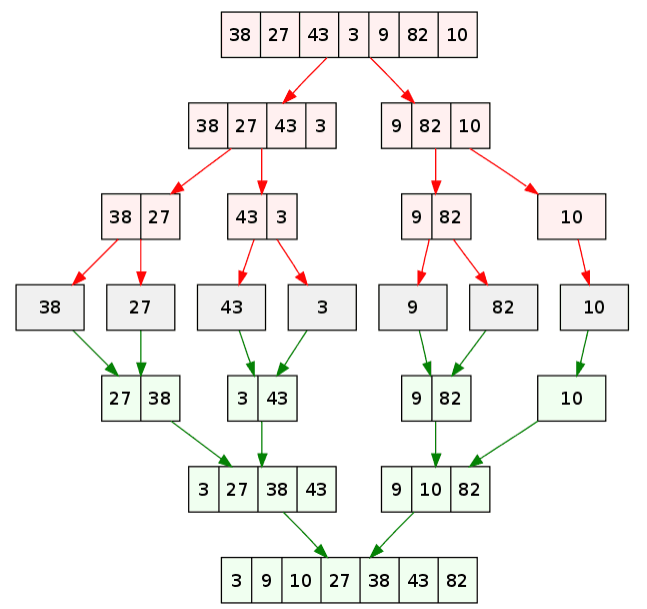

# Merge Sort

- El Merge Sort (o sorteo por mezcla) es un algoritmo de ordenamiento que utiliza el "superpoder" de la recursión para organizar listas de datos de manera altamente eficiente. Se basa en la estrategia de "divide y vencerás", descomponiendo un problema grande en partes minúsculas hasta que la solución se vuelve trivial.

## Mecanismo de Funcionamiento

- El algoritmo requiere de dos funciones principales que trabajan en conjunto:
  - La Función Recursiva (División): Esta función toma una lista desordenada y la divide en dos listas más pequeñas. Este proceso se repite recursivamente hasta que se llega al caso base: listas con una longitud de 1 o 0 elementos, las cuales, por definición, ya están ordenadas.
  - La Función de Mezcla (`merge`): Esta función no es recursiva. Su tarea es tomar dos listas que ya están ordenadas (el algoritmo asume que lo están) y combinarlas en una sola lista nueva, comparando los elementos uno a uno para mantener el orden correcto durante la unión.

## Análisis de Complejidad Temporal

- A diferencia de otros algoritmos vistos anteriormente (como Bubble o Insertion Sort), el Merge Sort destaca por su consistencia:
  - Complejidad $O(n \log n)$ en todos los casos: El mejor, el peor y el caso promedio tienen la misma complejidad. Esto sucede porque, sin importar si la lista original ya estaba ordenada o no, el algoritmo siempre la descompone hasta llegar a elementos individuales y luego la reconstruye por completo.
  - Eficiencia en el crecimiento: Al dividir la lista, el algoritmo evita comparar cada elemento con todos los demás. Por ejemplo, si sabemos que un grupo de números es mayor que otro, podemos tomar "atajos" en las comparaciones. Este comportamiento logarítmico ($\log n$) combinado con la necesidad de mirar cada elemento al menos una vez ($n$) resulta en la eficiencia de $O(n \log n)$, que es lo mejor que se puede obtener para un algoritmo de ordenamiento de propósito general.

## Complejidad Espacial

- El Merge Sort tiene una desventaja importante en comparación con algoritmos más simples: su alto costo de memoria.
  - Complejidad Espacial $O(n)$: Durante el proceso, el algoritmo crea y desecha constantemente nuevos arreglos para realizar las divisiones y mezclas. Dado que se termina creando aproximadamente un arreglo por cada elemento de la lista original, el espacio requerido crece de forma lineal con la entrada.

## Analogía

- Analogía para entender el Merge Sort:
  - Imagina que tienes una pila enorme de exámenes desordenados y varios asistentes. En lugar de ordenarlos tú solo, divides la pila en dos y le das cada mitad a un asistente, quien a su vez hace lo mismo hasta que alguien se queda con un solo examen (que ya está "ordenado"). Luego, los asistentes comienzan a subir los exámenes de regreso: cada uno recibe dos montones ya ordenados de sus subordinados y simplemente los va intercalando en una sola pila ordenada frente a él. Al final, recibes dos grandes pilas ordenadas y solo tienes que hacer una mezcla final para tener todo el conjunto perfectamente organizado.

## Representación Visual

## Infografía

