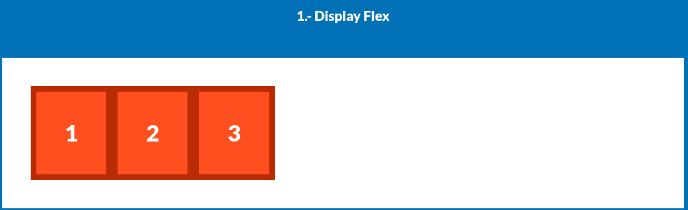
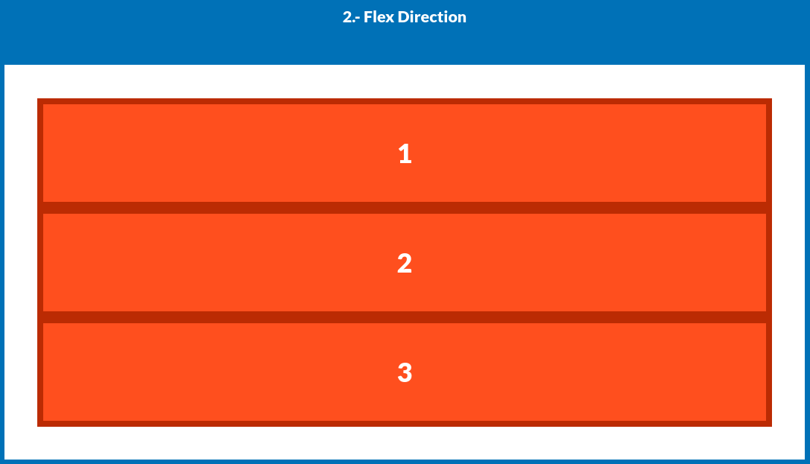
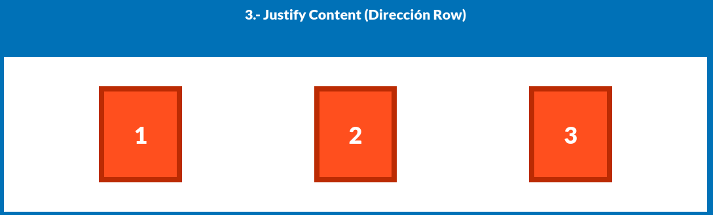
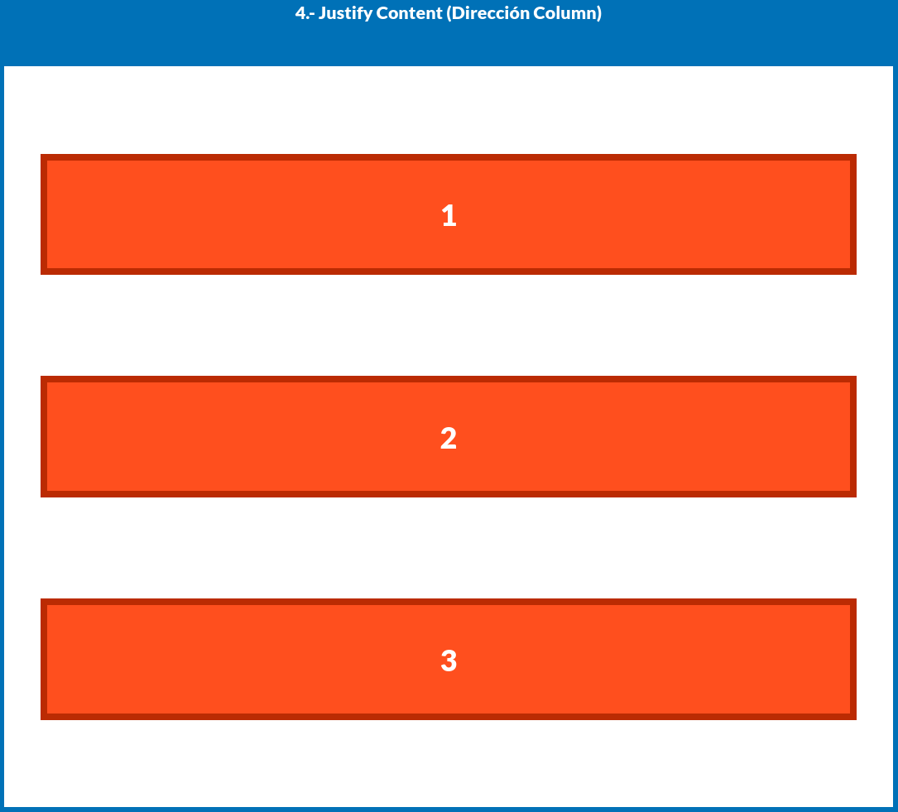
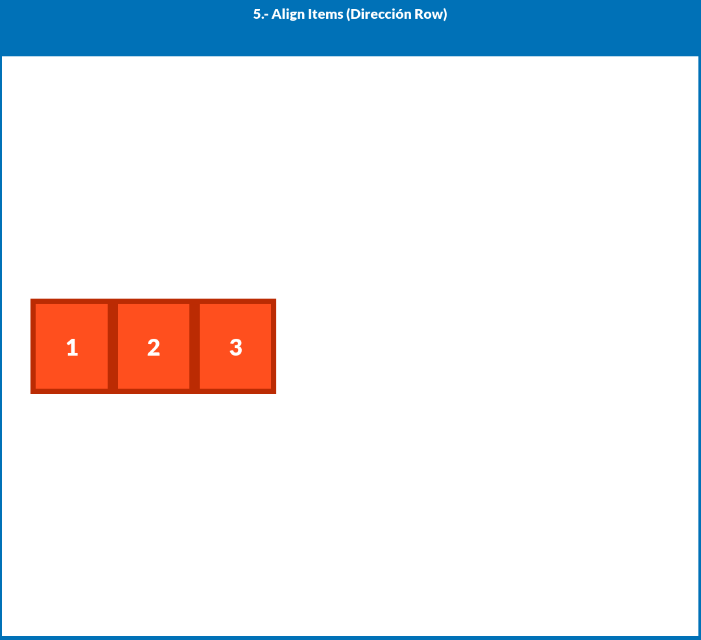
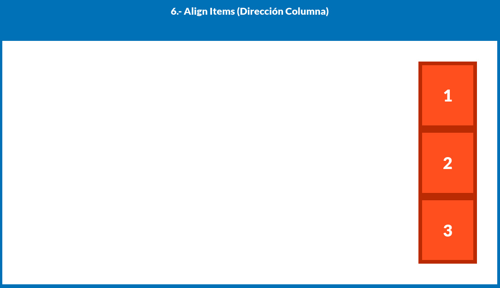
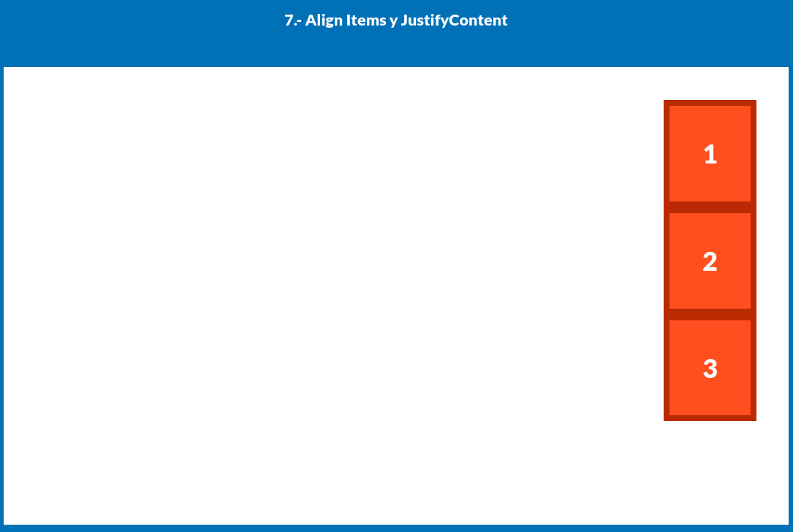
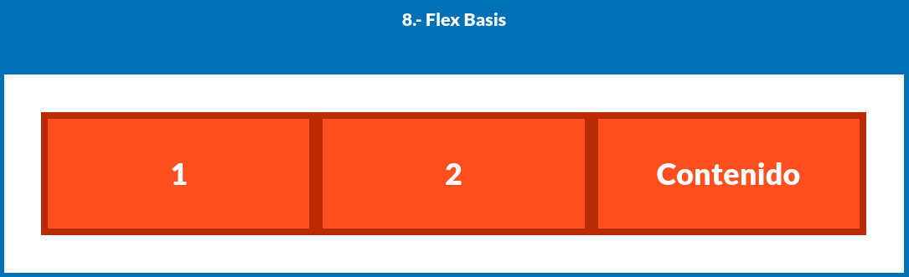

# Flexbox - Parte 1: Propiedades básicas y combinadas

En esta sección comenzamos a explorar las **propiedades fundamentales de Flexbox** aplicadas a distintos escenarios de alineación y distribución. Aprenderemos cómo afectan el diseño cuando se combinan entre sí.

---

## 1. `display: flex`



```css
.d-flex {
  display: flex;
}
```

Este es el punto de partida. Convierte al elemento en un **contenedor flex**, y a sus hijos en **elementos flexibles**.
El eje principal por defecto es horizontal (`row`), por lo tanto los hijos se colocan uno al lado del otro.

---

## 2. `flex-direction: column`



```css
.d-flex-2 {
  display: flex;
  flex-direction: column;
}
```

Cambia el eje principal de **horizontal a vertical**.
Los elementos hijos se colocan **de arriba hacia abajo**, en lugar de en fila.

---

## 3. `justify-content: space-around`



```css
.d-flex-3 {
  display: flex;
  justify-content: space-around;
}
```

Distribuye los elementos **horizontalmente** con **espacio igual alrededor de cada uno**.
Esto genera márgenes automáticos antes, entre y después de los elementos.

---

## 4. Combinación de `flex-direction: column` + `justify-content`



```css
.d-flex-4 {
  height: 1000px;
  display: flex;
  flex-direction: column;
  justify-content: space-around;
}
```

Ahora el eje principal es vertical.
`justify-content: space-around` distribuye los elementos a lo largo de la **altura**, con espacio alrededor de cada uno.

---

## 5. `align-items: center`



```css
.d-flex-5 {
  height: 1000px;
  display: flex;
  align-items: center;
}
```

* El eje principal sigue siendo horizontal (por defecto).
* `align-items` alinea los elementos a lo largo del **eje cruzado** (vertical).
* Aquí los elementos se colocan **centrados verticalmente** dentro del contenedor.

---

## 6. `align-items: flex-end` con dirección vertical



```css
.d-flex-6 {
  display: flex;
  flex-direction: column;
  align-items: flex-end;
}
```

Los elementos están dispuestos en **columna** y alineados hacia la **derecha del contenedor** (final del eje cruzado).

---

## 7. Combinación completa: dirección + alineación cruzada + distribución principal



```css
.d-flex-7 {
  display: flex;
  height: 700px;
  flex-direction: column;
  align-items: flex-end;
  justify-content: flex-start;
}
```

* Dirección: vertical
* Alineación cruzada: elementos **alineados a la derecha**
* Justificación: **empezando desde arriba**

Esto genera una pila de elementos desde arriba, alineados a la derecha.

---

## 8. `flex-basis`



```css
.d-flex-8 {
  display: flex;
}

.d-flex-8 .box {
  flex-basis: 33.3%;
}
```

* `flex-basis` define el **tamaño inicial** de un elemento flexible antes de que se distribuya espacio adicional.
* En este caso, cada `.box` ocupará aproximadamente **un tercio** del contenedor.

> Si hay 3 `.box` hijos, se ubicarán en una sola fila, cada uno ocupando el 33.3% del ancho del contenedor.

---

## Conclusión

Estas combinaciones de propiedades representan la base de Flexbox. Saber cómo se comportan en conjunto `flex-direction`, `justify-content`, `align-items` y `flex-basis` te permitirá construir estructuras más dinámicas, limpias y adaptables.
