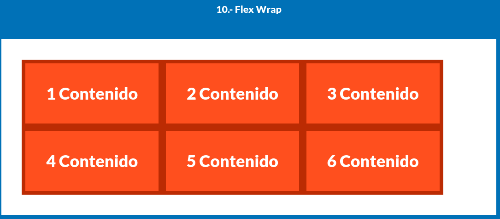
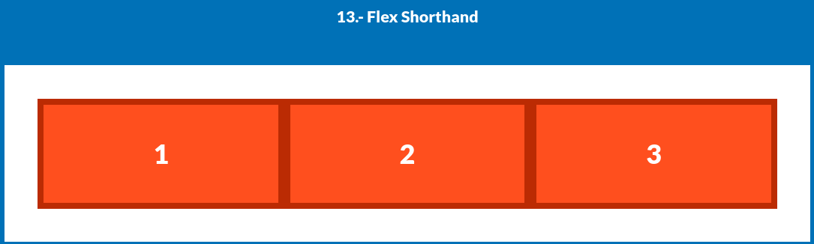

# Flexbox - Parte 2: Distribución, envoltura y control de tamaño

En esta segunda parte exploramos propiedades avanzadas que permiten distribuir mejor el espacio entre elementos, hacer que los contenedores se ajusten al contenido, y manejar cómo crecen o se reducen los elementos flexibles.

---

## 9. `gap` entre elementos flex


```css
.d-flex-9 {
  display: flex;
  gap: 2rem;
}

.d-flex-9 .box {
  flex-basis: 33.3%;
}
```

* `gap` crea espacio entre los hijos del contenedor (similar a `margin` pero más limpio y semántico).
* Con `flex-basis: 33.3%`, los elementos ocupan un tercio del ancho, con separación de `2rem` entre ellos.

---

## 10. `flex-wrap: wrap`



```css
.d-flex-10 {
  display: flex;
  flex-wrap: wrap;
}
```

Por defecto, los elementos en Flexbox se intentan ubicar en una sola línea.
Con `flex-wrap: wrap`, **los elementos que no caben bajan a una nueva línea**, útil para diseños adaptables.

---

## 11. `flex-grow`: control de expansión


```css
.d-flex-11 {
  display: flex;
}

.d-flex-11 .box:nth-child(1) { flex-grow: 1; }
.d-flex-11 .box:nth-child(2) { flex-grow: 2; }
.d-flex-11 .box:nth-child(3) { flex-grow: 1; }
```

* `flex-grow` indica cuánto puede **crecer** un elemento respecto a sus hermanos cuando hay espacio adicional.
* En este caso:

  * La caja 1 y 3 crecerán de forma igual.
  * La caja 2 crecerá **el doble** que las otras.

---

## 12. `flex-shrink`: control de reducción


```css
.d-flex-12 {
  display: flex;
}

.d-flex-12 .box {
  flex-grow: 1;
  flex-basis: 300px;
}

.d-flex-12 .box:nth-child(3) {
  flex-shrink: 2;
}
```

* `flex-basis` define un tamaño base.
* `flex-grow: 1` permite crecer si hay espacio.
* `flex-shrink` define cuánto puede reducirse **cuando el espacio es insuficiente**.
* Aquí, la tercera caja puede encogerse el doble que las demás para ajustarse.

---

## 13. `flex` shorthand



```css
.d-flex-13 {
  display: flex;
}

.d-flex-13 .box {
  flex-grow: 1;
  flex-shrink: 1;
  flex-basis: 33.3%;

  flex: 1 1 33.3%;
}
```

### `flex` = `flex-grow flex-shrink flex-basis`

Este atajo permite definir el comportamiento de crecimiento, reducción y base en una sola línea.
Es útil para mantener el código más limpio y legible.

---

## Resumen de propiedades

| Propiedad     | Función                                     |
| ------------- | ------------------------------------------- |
| `gap`         | Espacio entre elementos sin usar `margin`   |
| `flex-wrap`   | Permite que los elementos se bajen de línea |
| `flex-grow`   | Controla cuánto puede crecer un elemento    |
| `flex-shrink` | Controla cuánto puede reducirse un elemento |
| `flex-basis`  | Tamaño base inicial del elemento            |
| `flex`        | Shorthand para las tres anteriores          |

---

## Conclusión

Estas propiedades avanzadas permiten construir interfaces altamente adaptables. Saber controlar cómo los elementos **crecen**, **se encogen**, y **se distribuyen** en líneas múltiples es fundamental para crear diseños modernos y responsivos.
