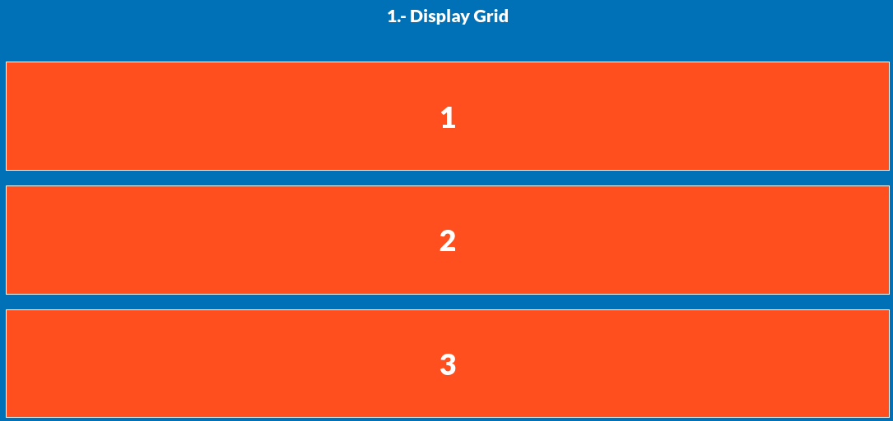
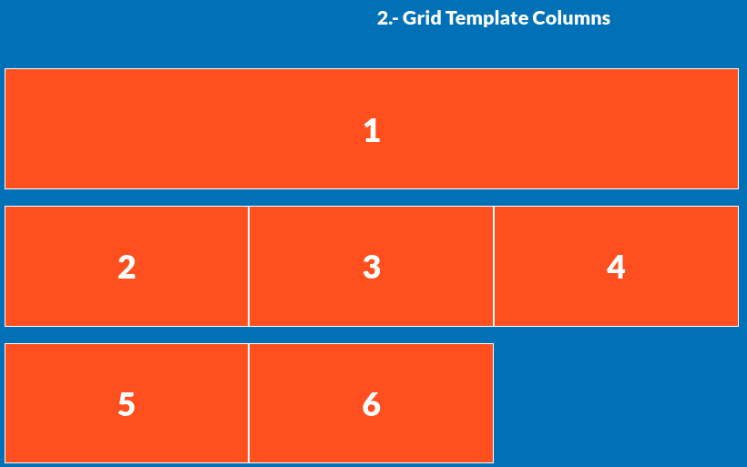
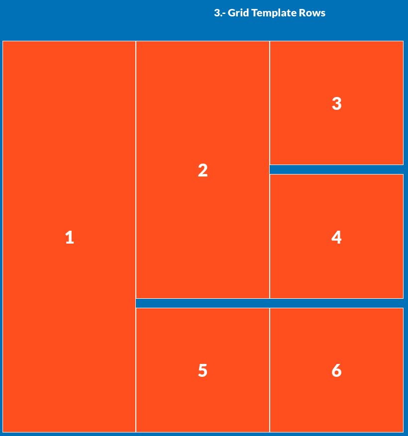
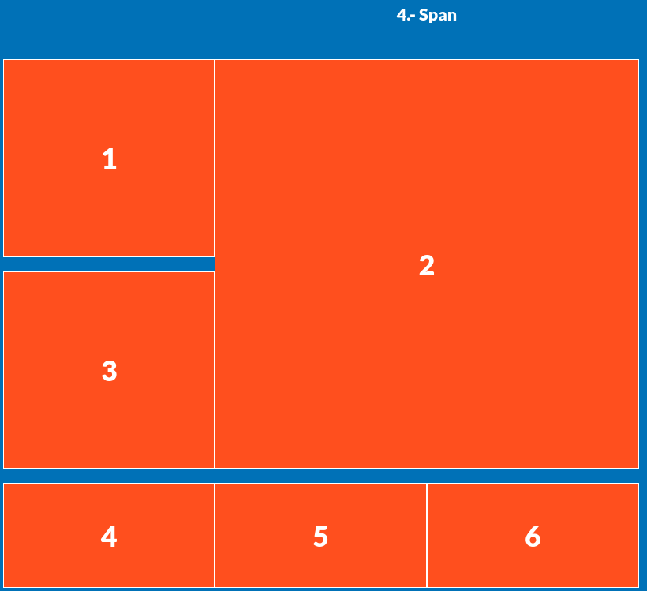
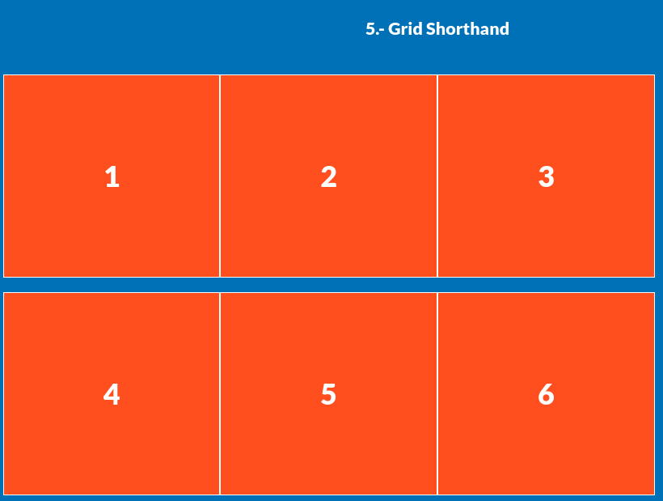
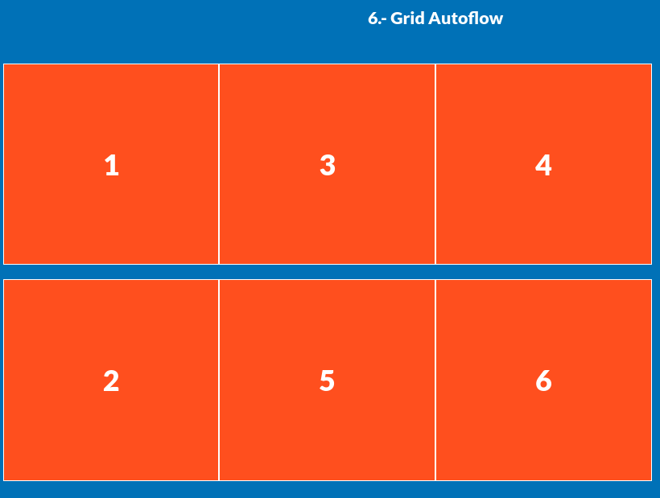

# CSS Grid - Parte 1: Fundamentos y posiciones básicas

En esta primera parte abordamos los conceptos iniciales de **CSS Grid Layout**, un sistema de diseño **bidimensional** ideal para construir estructuras complejas controlando filas y columnas al mismo tiempo.

---

## 1. Activar CSS Grid



```css
.grid-1 {
  display: grid;
}
```

Establece al contenedor como una cuadrícula. A partir de aquí, puedes usar propiedades como `grid-template-columns`, `grid-template-rows`, `gap`, etc.

---

## 2. Definir columnas y expandir columnas



```css
.grid-2 {
  display: grid;
  grid-template-columns: 300px 300px 300px;
}

.grid-2 .box:nth-child(1) {
  grid-column: 1 / 4; /* ocupa las tres columnas */
}
```

* Se definen **3 columnas fijas de 300px**.
* La primera caja se **extiende desde la columna 1 hasta la 4**, es decir, **ocupa las 3 columnas**.
* Se usa shorthand: `grid-column: inicio / fin`.

---

## 3. Filas y columnas combinadas con `repeat()`



```css
.grid-3 {
  display: grid;
  grid-template-rows: repeat(3, 300px);
  grid-template-columns: repeat(3, 300px);
}

.grid-3 .box:nth-child(1) {
  grid-row: 1 / 4; /* ocupa 3 filas */
}

.grid-3 .box:nth-child(2) {
  grid-row: 1 / 3; /* ocupa 2 filas */
}
```

* `repeat(n, valor)` simplifica definiciones repetitivas.
* Los elementos se pueden **extender verticalmente** usando `grid-row`.
* Ideal para crear mosaicos o galerías.

---

## 4. Expandir fila y columna con `span` o rango



```css
.grid-4 {
  display: grid;
  grid-template-rows: repeat(2, 300px);
  grid-template-columns: repeat(3, 300px);
}

.grid-4 .box:nth-child(2) {
  grid-column: 2 / 4; /* columnas 2 y 3 */
  grid-row: 1 / 3;    /* filas 1 y 2 */
}
```

* La segunda caja ocupa una **área de 2x2 celdas**.
* Se puede usar también `span` (ej. `grid-column: 2 / span 2`).

---

## 5. Shorthand con `grid`



```css
.grid-5 {
  display: grid;
  grid: repeat(2, 300px) / repeat(3, 300px);
}
```

* Es equivalente a:

  ```css
  grid-template-rows: repeat(2, 300px);
  grid-template-columns: repeat(3, 300px);
  ```
  
* La propiedad `grid` permite escribir **filas / columnas** en una sola línea.

---

## 6. `grid-auto-flow: dense`



```css
.grid-6 {
  display: grid;
  grid: repeat(2, 300px) / repeat(3, 300px);
  grid-auto-flow: dense;
}

.grid-6 .box:nth-child(2) {
  grid-column: 1 / 2;
}
```

* `grid-auto-flow: dense` intenta **rellenar huecos vacíos** automáticamente.
* Útil en diseños tipo **masonry** o rejillas con tamaños variables.
* El navegador reacomoda elementos si hay espacio disponible, respetando el orden visual.

---

## Conceptos clave utilizados

| Propiedad                 | Descripción                               |
| ------------------------- | ----------------------------------------- |
| `display: grid`           | Activa el layout Grid                     |
| `grid-template-columns`   | Define las columnas                       |
| `grid-template-rows`      | Define las filas                          |
| `grid-column`, `grid-row` | Posicionan elementos entre líneas         |
| `grid` (shorthand)        | Combina `rows / columns`                  |
| `grid-auto-flow`          | Controla el flujo automático de elementos |

---

## Conclusión

Estas técnicas te permiten controlar **exactamente dónde y cuánto espacio ocupa cada elemento** dentro de la cuadrícula. En la siguiente parte abordaremos áreas con nombres, alineaciones, fracciones (`fr`), y unidades responsivas.
