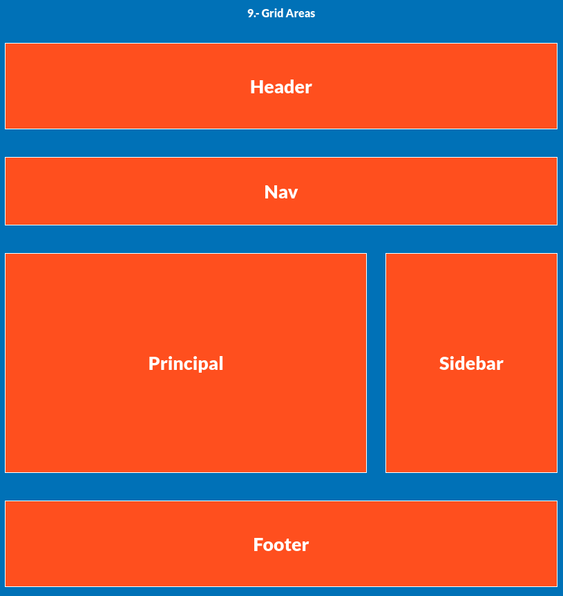
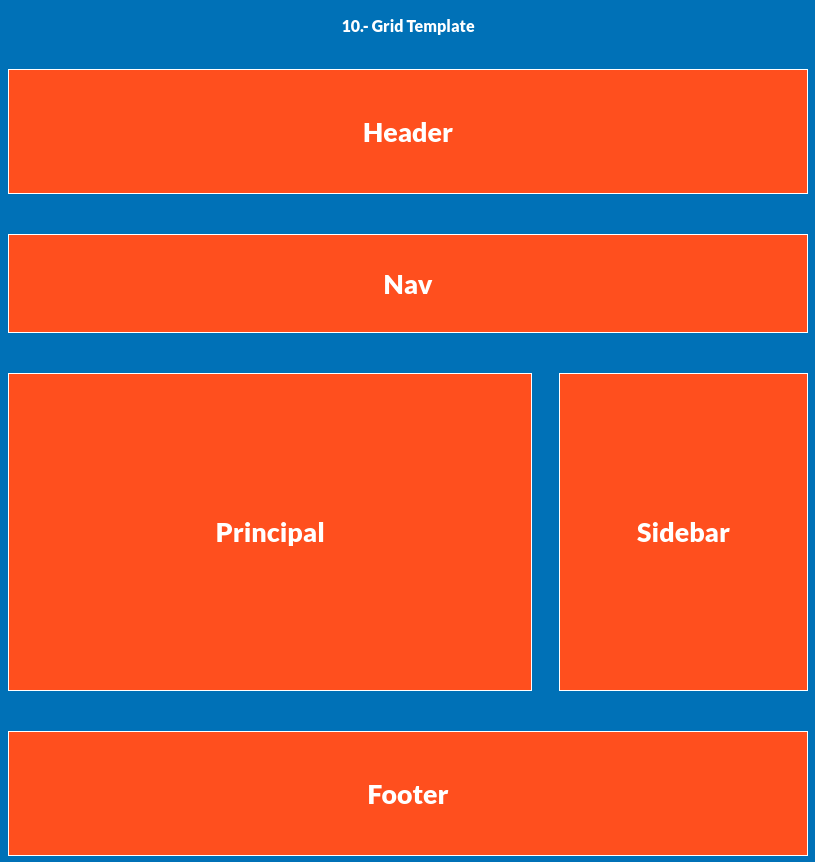
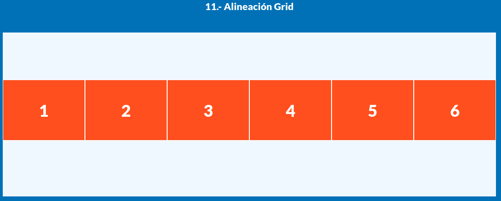

# CSS Grid - Parte 2: Distribución, áreas y adaptabilidad

En esta segunda parte nos enfocamos en propiedades avanzadas de CSS Grid para crear **layouts completos**, control de **espaciado**, **áreas con nombres**, y cuadrículas **adaptables**.

---

## 7. Fracciones con `1fr`


```css
.grid-7 {
  display: grid;
  grid-template-columns: repeat(3, 1fr);
}
```

* `fr` es una unidad flexible que **divide el espacio disponible**.
* Aquí se crean 3 columnas **de igual ancho**, cada una tomando `1fr` del total.

---

## 8. Separación entre filas y columnas con `gap`


```css
.grid-8 {
  display: grid;
  grid-template-columns: repeat(3, 1fr);
  column-gap: 1.5rem;
  row-gap: 1.5rem;
  gap: 1.5rem;
}
```

* `column-gap` y `row-gap` definen espacio **entre columnas y filas**.
* `gap` es un atajo que aplica el mismo valor a ambos ejes.

---

## 9. Uso de `grid-template-areas`



```css
.grid-9 {
  display: grid;
  height: 120rem;
  grid-template-areas:
    "header header header"
    "nav nav nav"
    "contenido contenido sidebar"
    "footer footer footer";

  grid-template-columns: repeat(3, 1fr);
  grid-template-rows: 2.5fr 1fr 6fr 2.5fr;
  gap: 4rem;
}
```

* `grid-template-areas` define **zonas nombradas** para mayor legibilidad.
* Cada `box` se asigna a una zona con `grid-area: nombre;`.
* Las fracciones en filas (`2.5fr`, `6fr`, etc.) indican alturas proporcionales.

---

## 10. Shorthand con `grid-template`



```css
.grid-10 {
  display: grid;
  height: 120rem;
  grid-template:
    "header header header" 2.5fr
    "nav nav nav" 1fr
    "contenido contenido sidebar" 6fr
    "footer footer footer" 2.5fr
    / 1fr 1fr 1fr;
  gap: 4rem;
}
```

* Equivale a definir `grid-template-areas`, `grid-template-columns` y `grid-template-rows` en una sola propiedad.
* Más limpio y directo, especialmente útil para layouts fijos.

---

## 11. Alineación con `align-items` y `place-content`



```css
.grid-11 {
  height: 400px;
  background-color: aliceblue;
  display: grid;
  grid-template-columns: repeat(6, 1fr);

  align-items: center;
  place-content: center;
}
```

* `align-items`: alinea **los hijos** en el eje vertical.
* `place-content`: alinea **toda la cuadrícula** dentro del contenedor.
* También existen `justify-items` y `place-items`.

---

## 12. Cuadrículas adaptables con `auto-fill`, `auto-fit` y `minmax()`


```css
.grid-12 {
  display: grid;
  grid-template-columns: repeat(auto-fit, minmax(200px, 1fr));
}
```

### Explicación

* `minmax(200px, 1fr)` define columnas que **como mínimo ocupan 200px**, pero **pueden expandirse** si hay espacio.
* `auto-fit` **rellena el espacio con columnas visibles**, incluso si hay menos elementos.
* `auto-fill` reserva espacio para columnas futuras (incluso vacías).

> Esta técnica es ideal para hacer **grillas responsivas** sin media queries.

---

## Conclusión

En esta sección hemos aprendido a:

* Usar unidades `fr` para distribuir espacio.
* Aplicar `gap` para separar elementos.
* Nombrar áreas con `grid-template-areas`.
* Alinear contenido con `place-content`.
* Crear layouts **adaptables** con `auto-fit` y `minmax()`.
